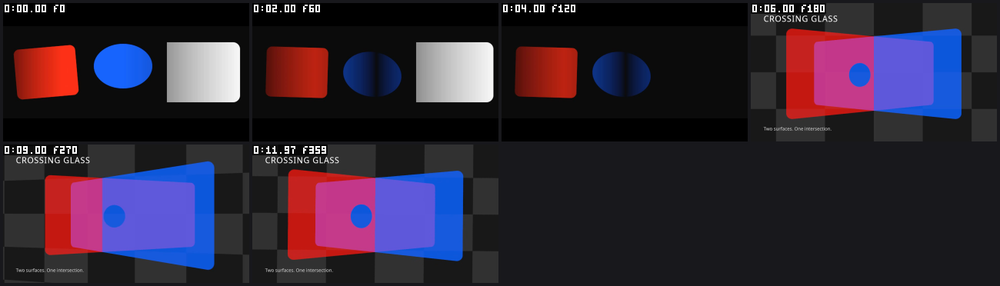

# Agent visual workflows: candidate execution, 2026-10-10

The combined candidate adds reusable named mattes, native planar depth,
inspection of encoded frames, selected-range exports, and portable quality
checks. The examples below exercise ordinary CLI and fresh stdio MCP routes.
They use synthetic source, the repository's licensed test font, exact rational
time, and the LGPL-only FFmpeg build.

The demonstrations below ran on release binaries built from
`cad3de7ec0398a563e8634529d996348b065cfde`. Candidate execution and retained-image
review are complete at the scopes below. The successor revision
`ce68abd4c979c4e7112fd863066a44ddf7da397a` adds two index concurrency fixes; it
was validated and installed. The matte/depth and selected-range demonstrations
were not rerendered on it; its own reference renders and installed fixture did run
(see [Combined validation, installation and CI](#combined-validation-installation-and-ci)).
This is not playback, listening, creative acceptance, or Adobe parity.

[View the 12-second synthetic showcase](artifacts/agent-visual-workflows/showcase-bt709.mp4).
The first six seconds show alpha, luma and hidden-source mattes; the next six
show crossing translucent planes. This lossy derivative preserves the layout
in the inspected samples but retains gradient banding and contour differences.
The exact source, binary, review and artifact hashes are recorded in
[the public receipt](artifacts/agent-visual-workflows/receipt.json).

## Executed user paths

| Change | Executed comparison | Result and limit |
| --- | --- | --- |
| Named mattes | One nonadjacent source supplies two independently moving recipients; alpha/luma and visible/hidden source variants; reversible typed edits | Native and lossless FFV1 samples agree. Hiding the source preserves the sampled recipient region while removing its uncovered presentation. The legacy adjacent control remains separate. |
| Planar depth | Crossing fractional-alpha cards, a subtractive window, orbit/roll, reordered authoring, and analytic interior controls | Per-pixel front/back changes appear in the inspected intersection samples. Cold CLI, warm fresh-MCP and forced CLI controls are bit-identical on the tested CPU backend; all 11 warm control chunks are reused. This is planar geometry, without mesh/PBR, lights, shadows or native aperture depth of field. |
| Encoded-frame inspection | `artifact_frames` and `preview_frames` at matching frame ordinals | The tools return comparable images with source/PTS provenance. The demonstrated FFV1 PNGs match the native samples. Encoded frame time comes from PTS and stream time base, not ordinal divided by nominal fps. Matrix/range handling is distinct from transfer or gamut conversion. |
| Selected-range export | Native 640×360 sequence at 24000/1001 fps; export frames `[30,110)` across chunk boundaries | Output has 80 frames. Its PCM is the exact 160160-sample-frame slice `[60060,220220)` of the full master. Interior full chunks are reused. The two cut boundary fragments cannot reuse the corresponding full-grid chunks; they render on first use and are cached under their own keys. Range audio uses full-program mastering followed by the cut. |
| Range edit and undo | Change the counter text in the final boundary chunk, rerender, then undo | Only the last 14-frame fragment rerenders after the edit; the first boundary fragment and both interior chunks are reused. Sampled neighboring frames are unchanged. Undo restores the exact original range file; the later full render reuses every chunk and matches the original full file. |
| Portable quality check | Five CLI and five fresh-MCP calls from a different working directory on a 48-frame synthetic master | Authored target, moved report, relative path and explicit-cache cases pass. Explicitly requesting the wrong loudness target fails, and an escaping directory is refused. This actual path used the earlier `9f1e093` debug candidate; combined tests cover its integration. |

The matte/depth run recorded 771 assertions, including preflight, protocol and
cleanup checks. Its picture evidence includes 66 native frames, 66 direct PNG
comparisons and selected encoded controls; these counts are not independent
creative judgments. The range run recorded 98 assertions over six CPU renders.
The matte/depth and selected-range renders used llvmpipe/lavapipe, with zero
recorded render retries, chunk restarts, OOM backoffs or device recreations. Preview recovery counters
were not exposed, so no corresponding preview claim is made.

## Defects found in the demonstrations

The original range fixture treated clip position as a top-left coordinate.
Its orange mover was clipped at the top and absent at the range start. A fresh
MCP typed edit corrected the layer-centre coordinates to x 320→900 and y 180.
One 80-frame rerender and four inspected instants showed the mover fully inside
y 150..209, with left edges 121/125/407/440 at source frames 30/31/101/109.
There were no changed pixels outside the before/after mover footprints; counter
and caption regions matched. The public fixture now contains that exact
transform. This was a fixture defect, not a render-engine correction.

The first matte/depth MP4 omitted color tags. `artifact_frames` therefore used
its declared untagged BT.601/limited fallback, although the viewing encode had
used BT.709/tv. A metadata-only stream copy added BT.709 limited tags. All 360
compressed packets, extradata, flags and timestamps were unchanged. At one
recorded red-panel pixel in frame 180, maximum RGB error against the master fell
from 19 to 4; whole-frame mean absolute error fell from 5.156 to 2.461. Six
matched samples and full frames were inspected. Residual edge error reaches
110 in the sampled controls: this does not establish exact RGB equality or
arbitrary-player color management. The original derivative remains retained.

The first matte/depth harness also tried to parse the text-only CLI `plan`
output as JSON. That run stopped before producing pictures. Its corrected
strict text parser was reviewed separately; it does not change the product's
CLI contract or turn displayed key prefixes into full-key proof.

## Combined validation, installation and CI

On `cad3de7`, the local combined run completed in 817 seconds with no leftover child
processes. It passed formatting, Clippy, the workspace tests, delivery unit/bin
tests, registered title acceptance, release builds, and the CPU reference
render checks. The workspace reported 659 passes, including three optional
self-skips (two OpenH264 and one real Whisper fixture), plus two ignored
doctests. Delivery added eight passes. The 27 registered title tests repeat a
workspace subset and are not additional unique coverage.

The CPU reference renders produced 288 and 312 frames. Independent cold runs
at jobs 1 and 2 were bit-identical, all 25 retained reference SSIM values were
1.0, and the audio hash matched. Optional OCIO, CEF, ThorVG and OpenFX stub
builds do not establish full-library integration.

Remote CI run `38009480085` on that revision failed
`legacy_cached_transcription_errors_are_retried`. Diagnosis found two
concurrency defects, and `ce68abd4` corrects both:

- **Test isolation.** One index test registered a process-global shot detector
  while a cache test could be running, which changed the detector-dependent
  cache key. The registration test now runs in its own test binary.
- **Product correction.** Two transcriptions of identical content in one
  process shared a scratch-file name. Scratch and temporary paths are now
  unique per invocation, with a deterministic regression test that runs
  identical-content transcriptions sequentially and concurrently.

The first correction alone failed its ninth repeated pass, which exposed the
second defect. With both, a focused run at default test parallelism passed the
index and registry tests, 20 consecutive repetitions and Clippy. The optional
real-Whisper test self-skipped in that run, so real Whisper was not exercised.

The combined run was repeated on `ce68abd4`. All seven steps passed in 886
seconds with no leftover child processes. The workspace reported 662 passes,
including the same three optional self-skips, plus two ignored doctests.
Delivery added eight passes, and the 27 registered title tests again repeat a
workspace subset. These workspace tests ran serially; the default-parallel
evidence is the focused run above. For the two CPU reference renders:

- independent cold runs at jobs 1 and 2 produced byte-identical files;
- the reported video and PCM hashes matched the historical references, whose
  container bytes differ, so no container equality is claimed;
- all 25 sampled SSIM values were 1.0.

The optional OCIO, CEF, ThorVG and OpenFX libraries were again built as stubs.

The four `ce68abd4` release binaries are installed. The previous binaries
were backed up and the agent configuration file is byte-identical before and
after. A fresh installed-route run then completed and was independently
accepted with no findings, at this narrow scope:

- a static 320×180 gray fixture, with the expected frozen-frame warning kept;
- checker calls from a different working directory on a 48-frame master,
  including an expected loudness failure and a refused outside-root path;
- a two-frame selected range through the configured MCP server, whose native
  and encoded sample images are byte-equal.

The run recorded 114 wrapper assertions and 71 portable-check assertions;
these are assertion counts, not unique tests. The range report's 4000 sample
frames are a reported figure, not an independent PCM decode, and nothing was
listened to. The fixture is static: uniform gray pixels cannot distinguish
adjacent frames or show motion, alpha, matte or depth correctness. The
runner's process-release record and the model's image inspection are separate
evidence. The run does not repeat the matte/depth demonstration, and it does
not show that an already-open agent session has reloaded its tools.

Remote CI run `38049021220` is on exactly `ce68abd4`. When observed at
2026-10-10 11:51 UTC it was still in progress: the formatting job had
succeeded and the Clippy, test and CPU render job had not finished. No remote
pass is claimed from local evidence.

The hashes for this section are in
[the ce68abd4 validation receipt](artifacts/agent-visual-workflows/validation-ce68abd4.json).
The PP-067 ledger receipt is refreshed from the executed title acceptance; it
does not promote any additional parity row. Translated-picture cache reuse is
separate, uncompiled source work and is not in the validated or installed
revision.

## Reproduction sources

- [Named matte source and reversible controls](../../examples/reusable-mattes/README.md)
- [Crossing-glass source and depth controls](../../examples/crossing-glass/README.md)
- [Selected-range fixture and CLI/MCP sequence](../../eval/creative/selected-range-demo/RUN.md)
- [Repository validation commands](../../CONTRIBUTING.md#checks-what-ci-runs)

Use a new output/cache directory and record the exact source, binaries and
adapter. Keep full-program and selected-range level scopes separate. A retained
image comparison establishes only its sampled instants; judging motion and
sound still requires playback and listening.
