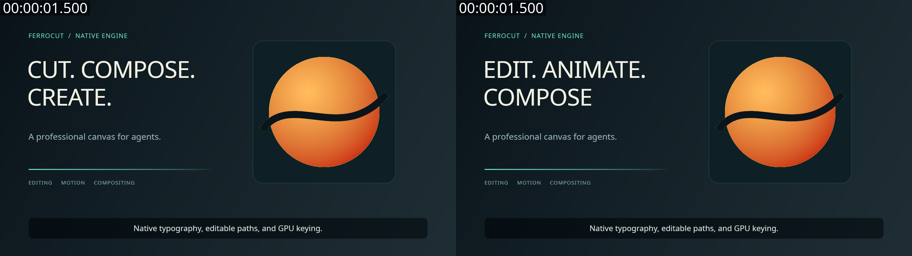

# Native graphics milestone — 2026-10-08

Ferrocut now has native editable text, vector geometry, basic grading/keying and
plain SRT/WebVTT captions in its normal timeline/compiler. These are an initial
professional feature slice. The project remains an early headless editor; this
milestone does not establish Premiere/After Effects production parity.

## What changed

- Native typography uses explicit, hashed font assets, Unicode shaping, kerning,
  ligatures, bidirectional text, wrapping/alignment, tracking/leading, an outside
  stroke and character/word/line range animators. Font assets resolve relative to
  projects and pass MCP root checks before the compiler opens them.
- Native vectors provide rectangles/rounded corners, ellipses and editable
  quadratic/cubic contours, fill rules, solid/multi-stop gradient paints, caps,
  joins, miter limits and animated dashes. Shapes can supply track-matte alpha.
- Six registered effects add exposure, contrast, saturation, lift/gamma/gain,
  chroma key and luma key to ordinary clip/track/adjustment stacks.
- Caption CLI import creates editable native text clips; export writes plain
  SRT/WebVTT. Unsupported styling/settings and overlapping cues on one import
  track fail explicitly. This is not embedded broadcast-caption support.
- The pre-existing Rhai work was retained. Effect-expression offsets survive
  splits, source expressions follow actual retiming, and timeline-time generator
  keyframes convert through the source map. Ambiguous repeated source values,
  nonmonotonic source-expression remaps and expression-driven timing/source
  reads fail with guidance. Bake timing expressions to keys first.
- Agent schemas describe the native payloads; MCP serves the worked guide at
  `docs://agent/onboarding.md`. Render cache version advances to `render.v3`.

## Executed checks

| Check | Observed result | Evidence |
| --- | --- | --- |
| Engine, MCP, types, core, audio and build regression | 305 passed, 0 failed, 1 ignored; before the final focused fixes below | [Log](artifacts/native-regressions.log) |
| Final native text/vector/finishing/caption/expression suites | 73 passed, 0 failed | [Log](artifacts/native-final-focus.log) |
| Final complete MCP package | 26 passed, 0 failed; includes resource serving, schemas, root containment and stdio | [Log](artifacts/native-final-mcp.log) |
| Scoped Clippy, all targets, warnings denied | Passed for engine, MCP and types | [Log](artifacts/native-clippy.log) |
| Scoped formatting and `git diff --check` | Passed for changed packages/files | Commands below |
| Ledger semantic/runner checks | 24 evidence/research/runner cases passed; canonical 456-ID ledger valid | `python3 scripts/parity-inventory.py self-test` and `check` |

These test counts overlap and must not be added together. Finishing tests compared
shader output to independent analytical references and exercised two identified
Vulkan adapters: NVIDIA GeForce RTX 5090 Laptop GPU and llvmpipe (LLVM 20.1.2).
That is two contexts on this workstation, not cross-platform certification.

```sh
cargo test --locked --offline -p ferrocut-engine -p ferrocut-mcp -p ferrocut-types -p ferrocut-core -p ferrocut-audio -p ferrocut-build -- --test-threads=1
cargo test --locked --offline -p ferrocut-engine --test captions --test source_expressions --test expressions --test text --test native_text_timeline --test vector --test finishing -- --test-threads=1
cargo test --locked --offline -p ferrocut-mcp -- --test-threads=1
cargo clippy --locked --offline -p ferrocut-engine -p ferrocut-mcp -p ferrocut-types --all-targets -- -D warnings
cargo fmt -p ferrocut-engine -p ferrocut-mcp -p ferrocut-types -- --check
git diff --check
python3 scripts/parity-inventory.py check
python3 scripts/parity-inventory.py self-test
```

## Actual render, revision and undo

The editable [showcase](../../examples/native-showcase.json) combines shaped
titles, animated vectors, nested native graphics, grading, keying and two caption
cues. Ferrocut rendered a **4-second, 1280×720, 24fps, 96-frame FFV1 master**.
An external FFmpeg probe and extracted frames inspected the result; FFmpeg did
not create the graphics. The sample has no audio or embedded subtitle stream.

| Operation | Observed behavior | Report |
| --- | --- | --- |
| Initial native render | Four chunks / 96 frames rendered on llvmpipe; 120,306ms, one worker under concurrent test load | [Initial](artifacts/ferrocut-native-showcase.report.json) |
| Journaled headline edit | `CUT. COMPOSE. / CREATE.` → `EDIT. ANIMATE. / COMPOSE.`; all four active chunks invalidated | [Edit](artifacts/ferrocut-native-showcase-revision.json) |
| Revised render | Four chunks / 96 frames rendered on llvmpipe; 57,307ms, two workers | [Revised](artifacts/ferrocut-native-showcase-revised.report.json) |
| Repeat revised render | 0 rendered / 96 reused frames; 0 GPU submissions | [Cache](artifacts/ferrocut-native-showcase-revised-cached.report.json) |
| Undo and render | 0 rendered / 96 reused frames; final file and video hashes exactly match the original | [Undo](artifacts/ferrocut-native-showcase-undone.report.json) |

The different worker counts/load prevent a speedup comparison. This sample does
not demonstrate realtime performance. [Probe](artifacts/ferrocut-native-showcase-probe.json)
confirms 8-bit FFV1, 16:9 and 24fps; output color metadata is not explicitly tagged.
The original video stream BLAKE3 is
`dc48e25de640674743695b2a3d5d0cfd6403cf3196b967d332e29436081502cd`.
The revised video stream BLAKE3 is
`b0f58d8c69c28a550fe983f8f91bd55c76f4da105a2f8e79cbb48703df955d9a`.
Full local masters remain at `/tmp/ferrocut-native-showcase.mkv` and
`/tmp/ferrocut-native-showcase-revised.mkv`; reports and PNG evidence are retained
here. [Manifest](artifacts/manifest.json) records retained-file SHA256 digests.



Actual frame inspection at 0, 0.5, 1.5 and 3 seconds found readable text inside the
intended areas, visible motion/fades and the correct two-second caption change.
The before/after frame at 1.5 seconds confirms the native title revision. A thin
green fringe remains around the keyed graphic: the basic keyer lacks professional
matte cleanup/edge refinement. This sample is a technical integration review,
not the demanding creative production acceptance target.

To reproduce using the already configured local dependencies:

```sh
cargo build --locked --offline -p ferrocut-engine -p ferrocut-mcp
python3 scripts/native-showcase.py
mkdir -p out/native
target/debug/ferrocut captions import examples/native-showcase.json examples/native-captions.srt --style examples/native-caption-style.text-style -o out/native/project.json
target/debug/ferrocut render out/native/project.json -o out/native/original.mkv --cpu --jobs 2
target/debug/ferrocut edit out/native/project.json examples/native-revise.ops --plan --json
target/debug/ferrocut render out/native/project.json -o out/native/revised.mkv --cpu --jobs 2
target/debug/ferrocut undo out/native/project.json --json
target/debug/ferrocut render out/native/project.json -o out/native/undone.mkv --cpu --jobs 2
```

## Capability completion and remaining work

The ledger contains **456 researched requirements: 443 stable and 13 beta**. Each
row has a source-backed implementation assessment;139 need explicit design or
dependency decisions. `PP-067` is verified against its narrow native-title
creation/edit/render criterion using current executable receipts and the inspected
render. Other integrated entries still need their own full acceptance evidence.
No entry has passed demanding agent-production/creative review.

Remaining work includes shape groups/operators, arbitrary mask stacks/feathering,
rich text/path text, advanced grading/key cleanup, tracking/roto, optical flow,
full 3D geometry/lights/depth, higher-bit-depth/alpha/HDR media I/O, multichannel
audio and interchange. The [Storytold review](STORYTOLD_REVIEW.md) identifies
FilmCraft/EffectCraft components to evaluate before rebuilding equivalents.
Their code was inspected, not installed or executed in this milestone.

The broader baseline exposed an existing native `ferrocut-color` parallel-test
SIGSEGV involving its OOM test. All eight tests passed serially on default and
software contexts, and seven passed in parallel with OOM excluded; the cause is
unresolved. HTML determinism initially failed Chromium socket creation in the
sandbox; all seven passed after the required approved rerun outside it. Whole
workspace formatting also has pre-existing differences in other crates. These
findings prevent a claim that every workspace check is green.

All implementation remains uncommitted. The 16 pre-existing changed/untracked
expression files were preserved before work in
`/tmp/ferrocut-before-parity-build-20261008/`. Project edits are reversible through
the journal/undo operations above; code rollback must preserve that earlier work.
